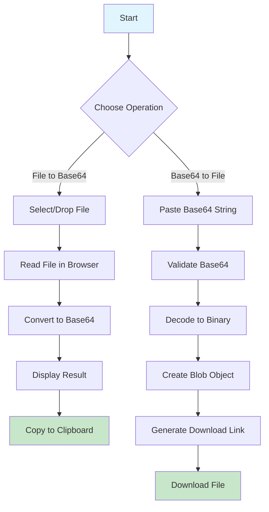
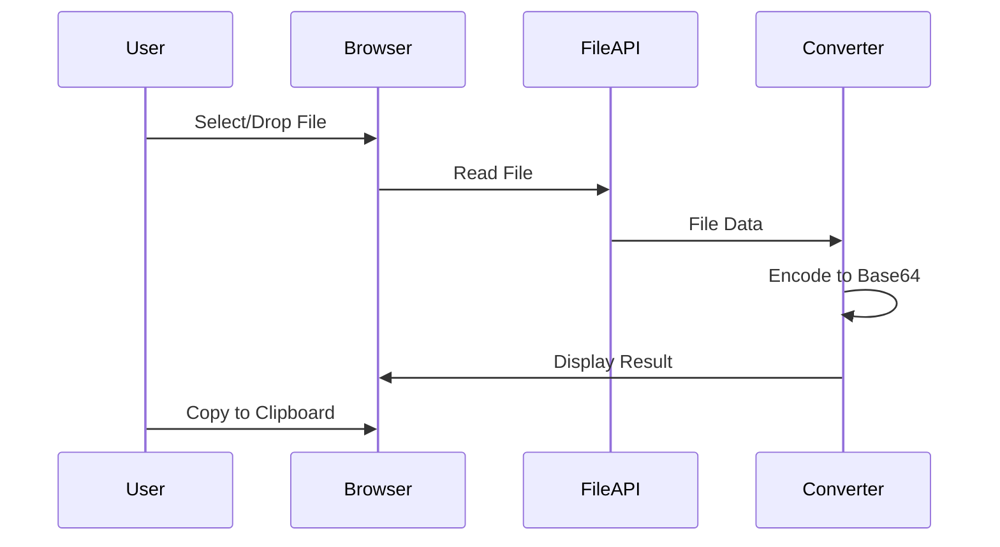
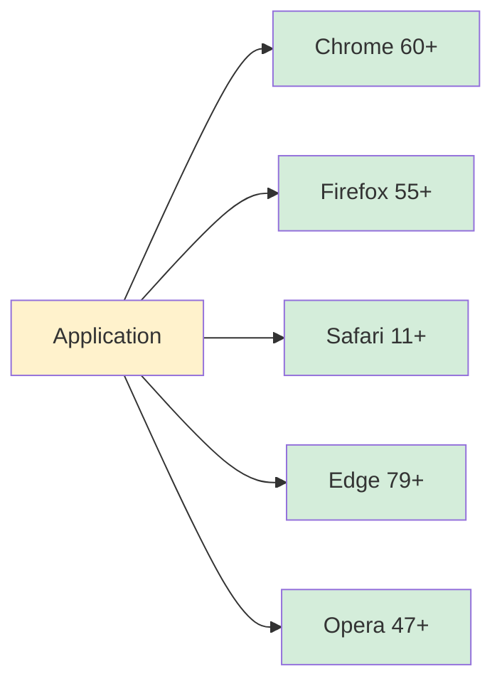

# 🔐 xsukax File ↔ Base64 Converter

[](https://github.com)
[](https://github.com)
[](https://github.com)

A secure, privacy-focused web application for converting files to Base64 encoding and back. All processing happens directly in your browser - your files never leave your device.


## 🌟 Key Features

### 🛡️ **Security & Privacy First**
- **100% Client-Side Processing**: All conversions happen in your browser
- **Zero Server Uploads**: Your files never leave your device
- **No Data Collection**: We don't track, store, or see your files
- **No External Dependencies**: Pure JavaScript implementation
- **No Network Requests**: Works completely offline once loaded
- **No Cookies or Analytics**: Your privacy is absolute

### ⚡ **Performance & Convenience**
- **Instant Conversion**: No waiting for server responses
- **Large File Support**: Handle files up to 100MB
- **Drag & Drop Interface**: Simply drop your files to convert
- **Progress Tracking**: Visual feedback for large file processing
- **One-Click Copy**: Easy clipboard integration for Base64 strings
- **Auto-Detection**: Automatically identifies file types from Base64

## 🎯 Benefits

### For Developers
- Quickly encode files for embedding in JSON APIs
- Convert images to Base64 for inline CSS/HTML
- Prepare binary data for text-based protocols
- Debug Base64 encoded data from APIs

### For Security Professionals
- Safely inspect Base64 encoded payloads
- Convert suspicious files without server exposure
- Analyze encoded data in isolated environment
- No digital footprint of your activities

### For Privacy-Conscious Users
- Convert sensitive documents without cloud exposure
- Process personal files with complete privacy
- No account required, no tracking, no logs
- Works offline after initial page load

## 📊 How It Works



## 🚀 Usage Guide

### Converting File to Base64

1. **Open the Application**
   - Navigate to the File → Base64 tab (default view)

2. **Select Your File** (Choose one method):
   - **Click Method**: Click the upload area to browse files
   - **Drag & Drop**: Drag file directly onto the upload area
   - **File Input**: Use the hidden file input for accessibility

3. **View File Information**
   - File name, size, type, and last modified date displayed
   - Progress bar shows conversion status for large files

4. **Get Your Result**
   - Base64 string appears in the text area
   - Includes data URI format (e.g., `data:image/png;base64,...`)
   - Click "Copy to Clipboard" for easy sharing



### Converting Base64 to File

1. **Switch to Base64 → File Tab**
   - Click the second tab in the interface

2. **Paste Your Base64 Data**
   - Supports both formats:
     - Full data URI: `data:image/png;base64,iVBORw0...`
     - Raw Base64: `iVBORw0KGgoAAAANSUhEUgAA...`

3. **Optional: Specify Filename**
   - Enter custom filename with extension
   - Leave blank for auto-detection based on MIME type

4. **Convert & Download**
   - Click "Convert & Prepare Download"
   - Review detected file information
   - Click "Download File" to save

## 📋 Supported File Types

The converter supports **150+ file formats** including:

### 🖼️ Images
`JPG`, `PNG`, `GIF`, `WebP`, `SVG`, `BMP`, `TIFF`, `ICO`, `PSD`

### 📄 Documents
`PDF`, `DOC`, `DOCX`, `XLS`, `XLSX`, `PPT`, `PPTX`, `ODT`, `RTF`

### 🎵 Audio
`MP3`, `WAV`, `OGG`, `AAC`, `FLAC`, `M4A`, `WMA`, `OPUS`

### 🎬 Video
`MP4`, `AVI`, `MOV`, `WebM`, `WMV`, `MKV`, `FLV`, `3GP`

### 💻 Code & Data
`JSON`, `XML`, `CSV`, `TXT`, `HTML`, `CSS`, `JS`, `PY`, `JAVA`

### 📦 Archives
`ZIP`, `RAR`, `7Z`, `TAR`, `GZ`, `BZ2`

### And many more...

## 🔧 Technical Specifications

| Feature | Specification |
|---------|--------------|
| Max File Size | 100 MB |
| Encoding Method | Base64 (RFC 4648) |
| Browser Compatibility | All modern browsers (Chrome, Firefox, Safari, Edge) |
| JavaScript Required | Yes |
| External Dependencies | None |
| Offline Capability | Yes (after initial load) |
| Mobile Support | Fully responsive design |

## 🌐 Browser Compatibility



## 🚦 Security Features

### Data Protection
- ✅ No server-side processing
- ✅ No data transmission
- ✅ No temporary file storage
- ✅ No browser cache for file data
- ✅ Automatic memory cleanup

### Privacy Guarantees
- ✅ No user tracking
- ✅ No analytics scripts
- ✅ No third-party libraries
- ✅ No external resources
- ✅ No cookies or local storage

## 💡 Use Cases

### Web Development
```javascript
// Embed image directly in HTML


// Include file in JSON API
{
  "document": "data:application/pdf;base64,JVBERi0xLj..."
}
```

### Email Attachments
Convert files to Base64 for embedding in email systems that support inline attachments.

### Configuration Files
Store binary data in text-based configuration files or environment variables.

### Data Transfer
Send binary files through text-only channels (chat, forms, etc.).

## ⚙️ Installation

### Option 1: Direct Usage
Simply open the HTML file in any modern web browser. No installation required.

### Option 2: Host on Your Server
```bash
# Clone the repository
git clone https://github.com/xsukax/xsukax-File-Base64-Converter.git

# Navigate to directory
cd xsukax-File-Base64-Converter

# Open in browser or serve with any web server
python -m http.server 8000
# Visit http://localhost:8000
```

### Option 3: GitHub Pages
1. Fork this repository
2. Enable GitHub Pages in Settings
3. Access via `https://yourusername.github.io/file-base64-converter/`

## 🎨 Features in Detail

### Smart File Type Detection
The application automatically detects and assigns appropriate file extensions based on MIME types when converting from Base64.

### Real-Time Validation
- Base64 string validation before conversion
- File size checking before processing
- MIME type verification for accurate file reconstruction

### User-Friendly Interface
- Clean, modern design
- Intuitive tab navigation
- Visual feedback for all actions
- Responsive layout for all devices
- Accessibility-friendly controls

## 🔒 Privacy Policy

**We collect absolutely no data.** 

- No files are uploaded to any server
- No usage statistics are collected
- No personal information is requested
- No cookies are set
- No external requests are made

Your files remain 100% private and under your control.

## 📝 License

This project is licensed under the GNU General Public License v3.0 - see the LICENSE file for details.

## ⚠️ Limitations

- Maximum file size: 100MB (browser memory constraints)
- Requires JavaScript enabled in browser
- Large files may take time to process depending on device performance

## 🙏 Acknowledgments

- Pure JavaScript implementation for maximum compatibility
- No external dependencies for enhanced security
- Inspired by the need for privacy-focused tools

## 📧 Support

For issues, questions, or suggestions:
- Open an issue on GitHub
- Check existing issues for solutions
- Contribute improvements via pull requests

---

**Remember**: Your files never leave your device. This tool respects your privacy and security above all else.

🔐 **Safe** | 🚀 **Fast** | 🔒 **Private** | 💯 **Free**
